
# 1.背景
文本是人类最伟大和最具影响力的发明之一，是人类智慧的结晶,是人类文化、思想传承的一种基本的表达方式和不可或缺的载体。在21世纪,文本与日常生活密切相关。描述、理解万事万物,表达情感,与他人交流都离不开文本。文本以各种形式存在于生活中,尤其在信息时代,随着数码相机、智能手机等具有拍照和摄像功能的便携式电子设备的广泛使用,大量的文本也以图像或者视频的数据方式被保存下来。同时,移动互联网技术的飞速发展使得这类数据的传播和分享更加便捷。因此,人们迫切希望利用计算机对图像或视频中的文本进行检测识别,形成语义表达的方式对其进行理解。

# 2.识别效果
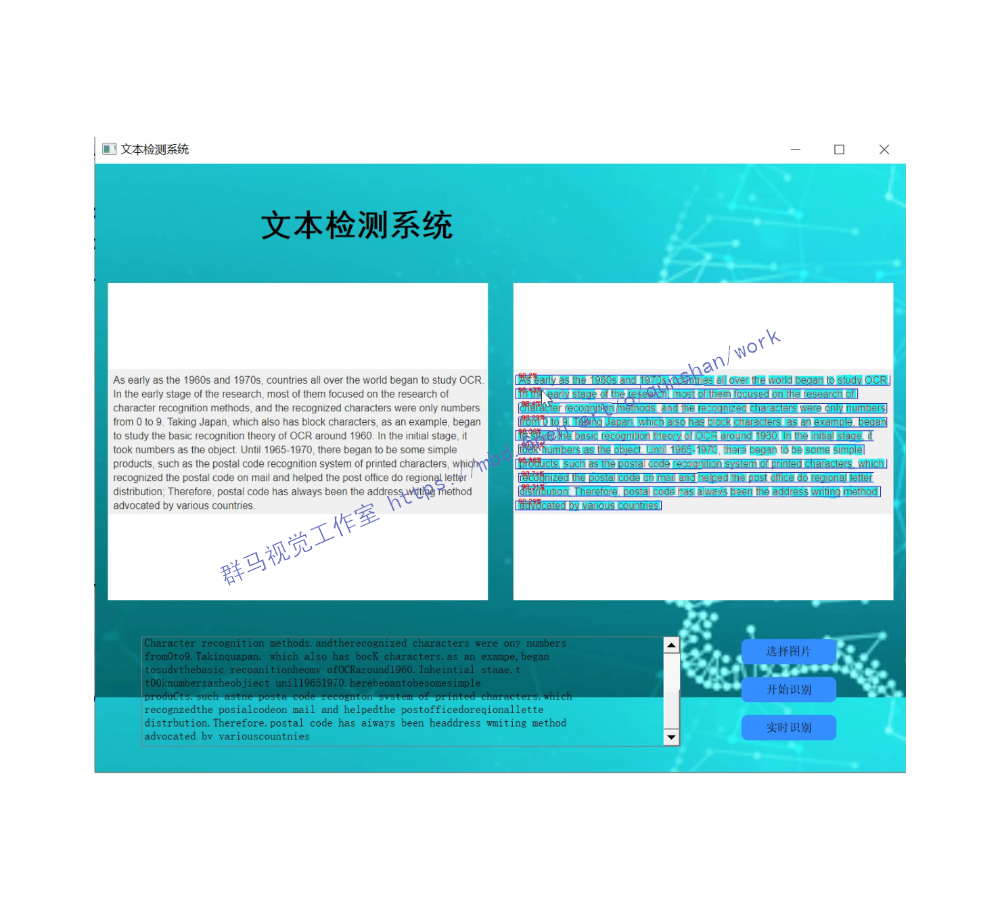

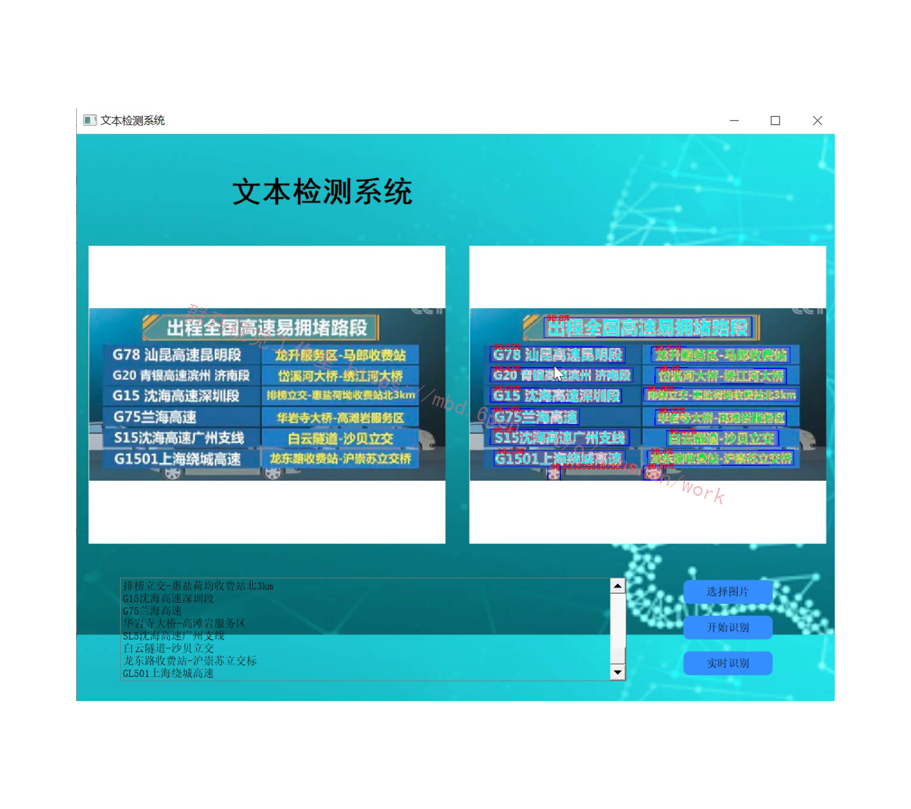

# 3.实时摄像头识别
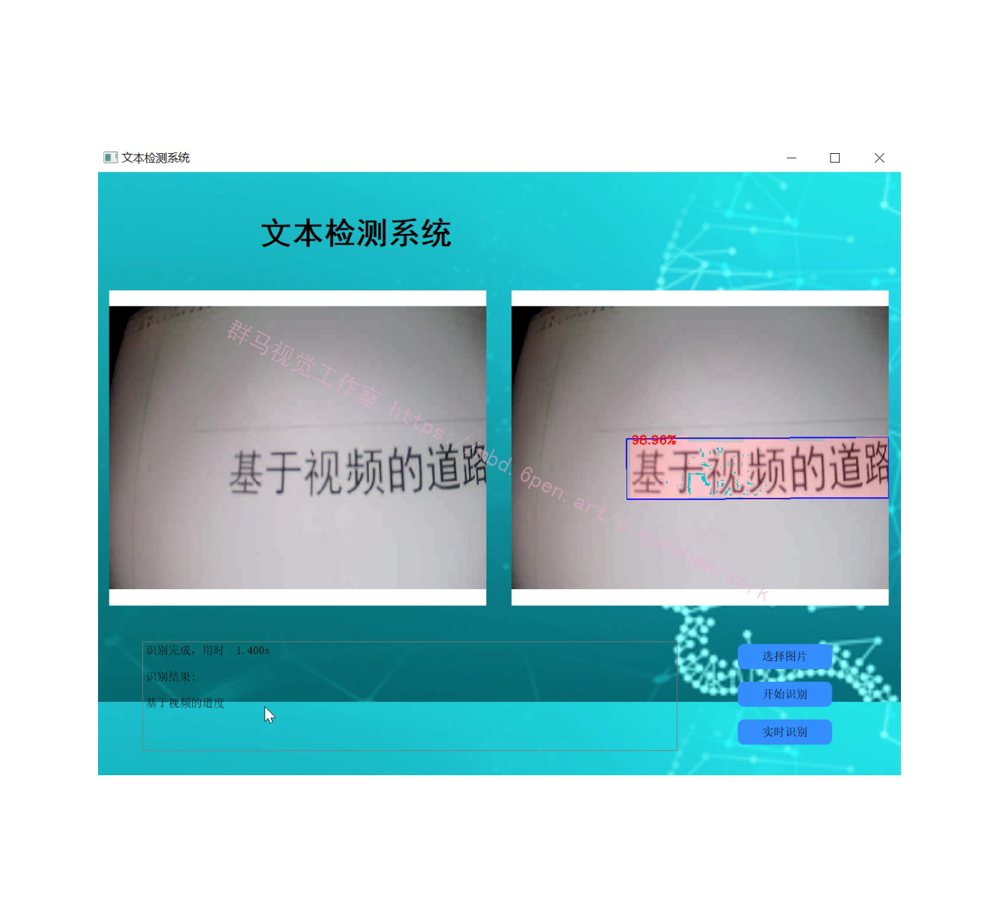

# 4.视频演示
[Python基于CRNN＆CTPN的文本检测系统（源码＆教程）_哔哩哔哩_bilibili](https://www.bilibili.com/video/BV1jB4y1n7NQ/?vd_source=bc9aec86d164b67a7004b996143742dc)

# 5.CTPN简介
CTPN是在ECCV 2016提出的一种文字检测算法。CTPN结合CNN与LSTM深度网络，能有效的检测出复杂场景的横向分布的文字，效果如下图，是目前比较好的文字检测算法。
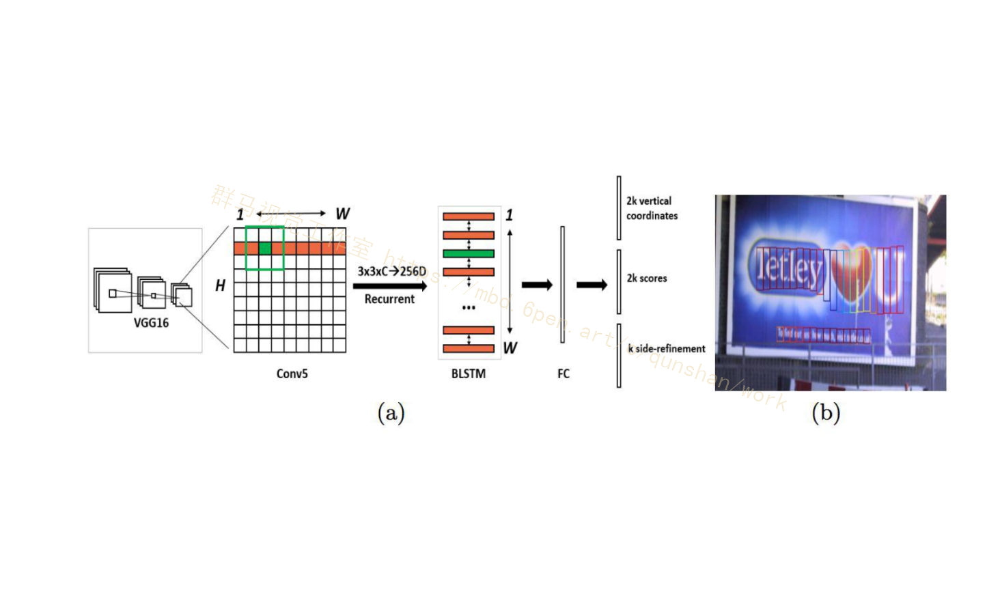
CTPN算法的提出，出于以下几点：

 (1)、假设文本是水平的；

 (2)、文本可以看做由每一个“字母”组成的。这里的字母可以认为是小片段。之所以有这样的想法，是因为基于通用目标检测的算法难以适应文字检测的场景，如上图中的文字，长度方面变化幅度很大。

因此作者将文本在水平方向解耦，分成每一个小片，然后将文本行的检测转化为小片的检测，最后利用规则将属于同一水平行的小片组合成文本行。化繁为简。

CTPN的创新点主要由以下三点：

(1)、将文本行拆分为slice进行检测，这样在检测过程中只需要对文本的高度进行先验性的设置anchor。

(2)、作者认为文本具有时序性，即和阅读习惯一直，从左到右。因此作者加入RNN获取这种语义性。

(3)、后处理算法：文本连接算法。

# 6.改进后的CTPN的网络结构
原始CTPN只检测横向排列的文字。[参考该博客改进后的CTPN结构](https://mbd.pub/o/bread/Y5aXkplx)与Faster R-CNN基本类似，但是加入了LSTM层（CNN学习的是感受野内的空间信息，LSTM学习的是序列特征。对于文本序列检测，显然既需要CNN抽象空间特征，也需要序列特征，毕竟文字是连续的）。假设输入N Images：
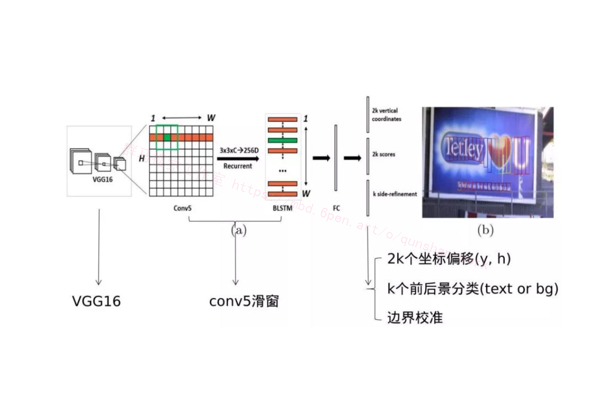
CTPN的整体结构与流程：

1.首先通过BackBone架构网络VGG16进行特征的提取，其Conv5层输出N x C x H x W的特征图，由于VGG16的卷积网络中经过4个池化层累计的Stride为16。也就是Conv5层输出的Feature map中一个像素对应原图的16像素。

2.然后在Conv5上做3 x 3的滑动窗口，即每个点都结合周围3 x 3区域特征获取一个长度为3 x 3 x C的特征向量。如下图所示，输出为N x 9C x H x W的Feature map，该特征依然是由CNN学习到的空间特征。
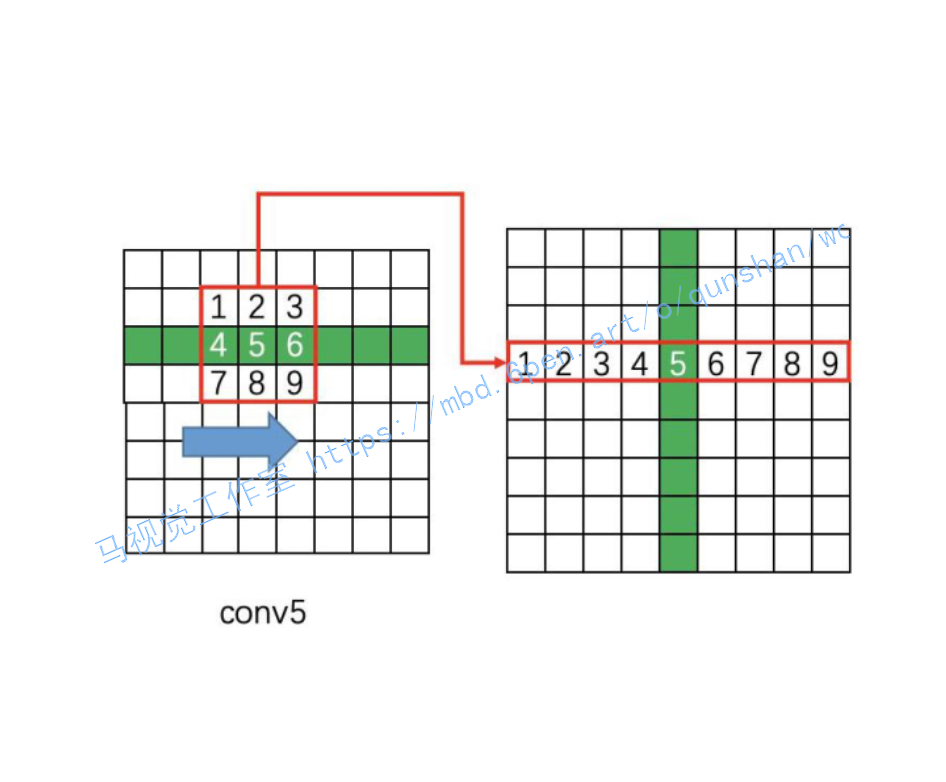

# 7.如何通过FC层输出产生Text proposals
CTPN通过CNN和BLSTM学到一组“空间 + 序列”特征后，在"FC"卷积层后接入RPN网络。这里的RPN与Faster R-CNN类似，分为两个分支：

左边分支用于Bounding Box Regression。由于FC Feature map每个点配备了10个Anchor，同时只回归中心y坐标与高度2个值，所以RPN_bboxp_red有20个Channels；

右边分支用于Softmax分类Anchor。
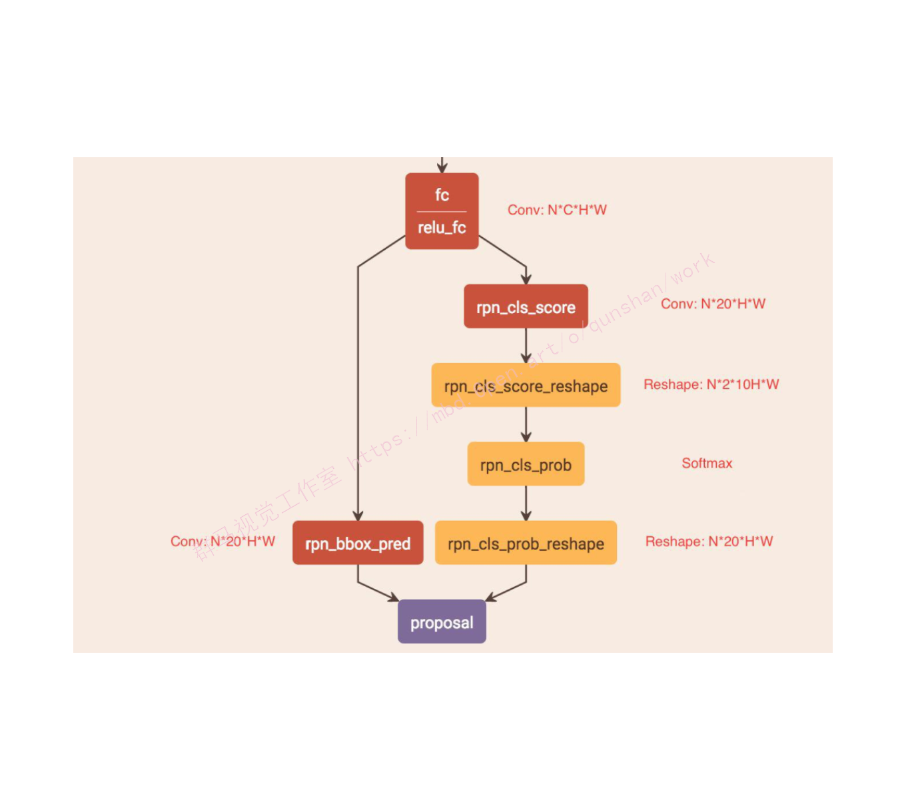

# 8.CTPN的训练
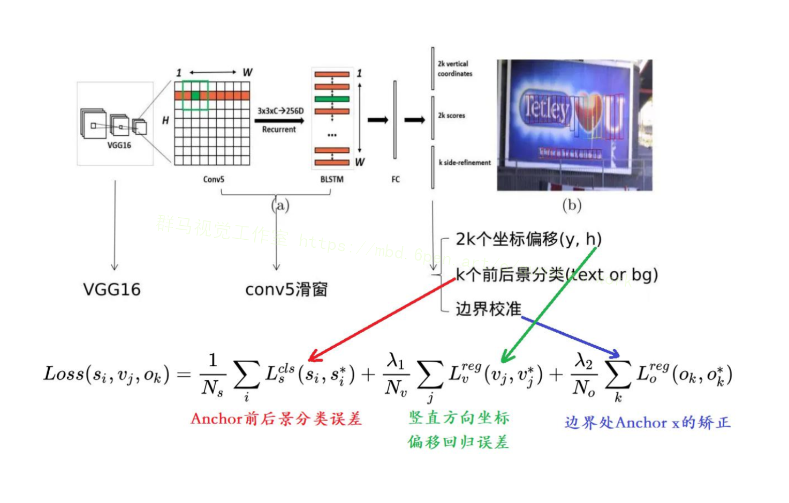

Anchor前后景分类误差：该Loss用于监督学习每个Anchor中是否包含文本。 s^{*}_{i}={0,1}表示是否是Groud truth。

竖直方向坐标偏移回归误差：该Loss用于监督学习每个包含为本的Anchor的Bouding box regression y方向offset，类似于Smooth L1 loss。其中vj是si中判定为有文本的Anchor，或者与Groud truth vertical IoU>0.5。

边界处Anchor x的矫正误差：该Loss用于监督学习每个包含文本的Anchor的Bouding box regression x方向offset，与y方向同理。

前两个Loss存在的必要性很明确，但这个Loss有何作用作者没有解释（从训练和测试的实际效果看，作用不大）说明一下，在Bounding box regression的训练过程中，其实只需要注意被判定成正的Anchor，不需要去关心杂乱的负Anchor。这与Faster R-CNN类似。

#### 代码实现
```
"""
This file is to change MSRA_TD500 dataset format to ICDAR2015 dataset format.

MSRA_TD500 format: [index difficulty_label x y w h angle]

ICDAR2015 format: [left_top_x left_top_y right_top_X right_top_y right_bottom_x right_bottom_y left_bottom_x left_bottom_y]

"""


import math
import cv2
import os

# 求旋转后矩形的4个坐标
def get_box_img(x, y, w, h, angle):
    # 矩形框中点(x0,y0)
    x0 = x + w/2
    y0 = y + h/2
    l = math.sqrt(pow(w/2, 2) + pow(h/2, 2))  # 即对角线的一半
    # angle小于0，逆时针转
    if angle < 0:
        a1 = -angle + math.atan(h / float(w))  # 旋转角度-对角线与底线所成的角度
        a2 = -angle - math.atan(h / float(w)) # 旋转角度+对角线与底线所成的角度
        pt1 = (x0 - l * math.cos(a2), y0 + l * math.sin(a2))
        pt2 = (x0 + l * math.cos(a1), y0 - l * math.sin(a1))
        pt3 = (x0 + l * math.cos(a2), y0 - l * math.sin(a2))  # x0+左下点旋转后在水平线上的投影, y0-左下点在垂直线上的投影，显然逆时针转时，左下点上一和左移了。
        pt4 = (x0 - l * math.cos(a1), y0 + l * math.sin(a1))
    else:
        a1 = angle + math.atan(h / float(w))
        a2 = angle - math.atan(h / float(w))
        pt1 = (x0 - l * math.cos(a1), y0 - l * math.sin(a1))
        pt2 = (x0 + l * math.cos(a2), y0 + l * math.sin(a2))
        pt3 = (x0 + l * math.cos(a1), y0 + l * math.sin(a1))
        pt4 = (x0 - l * math.cos(a2), y0 - l * math.sin(a2))
    return [pt1[0], pt1[1], pt2[0], pt2[1], pt3[0], pt3[1], pt4[0], pt4[1]]


def read_file(path):
    result = []
    for line in open(path):
        info = []
        data = line.split(' ')
        info.append(int(data[2]))
        info.append(int(data[3]))
        info.append(int(data[4]))
        info.append(int(data[5]))
        info.append(float(data[6]))
        info.append(data[0])
        result.append(info)
    return result


if __name__ == '__main__':
    file_path = '/home/ljs/OCR_dataset/MSRA-TD500/test/'
    save_img_path = '../dataset/OCR_dataset/ctpn/test_im/'
    save_gt_path = '../dataset/OCR_dataset/ctpn/test_gt/'
    file_list = os.listdir(file_path)
    for f in file_list:
        if '.gt' in f:
            continue
        name = f[0:8]
        txt_path = file_path + name + '.gt'
        im_path = file_path + f
        im = cv2.imread(im_path)
        coordinate = read_file(txt_path)
        # 仿照ICDAR格式，图片名字写做img_xx.jpg，对应的标签文件写做gt_img_xx.txt
        cv2.imwrite(save_img_path + name.lower() + '.jpg', im)
        save_gt = open(save_gt_path + 'gt_' + name.lower() + '.txt', 'w')
        for i in coordinate:
            box = get_box_img(i[0], i[1], i[2], i[3], i[4])
            box = [int(box[i]) for i in range(len(box))]
            box = [str(box[i]) for i in range(len(box))]
            save_gt.write(','.join(box))
            save_gt.write('\n')


```
# 9.CRNN简介
现今基于深度学习的端到端OCR技术有两大主流技术：CRNN OCR和attention OCR。其实这两大方法主要区别在于最后的输出层（翻译层），即怎么将网络学习到的序列特征信息转化为最终的识别结果。这两大主流技术在其特征学习阶段都采用了CNN+RNN的网络结构，CRNN OCR在对齐时采取的方式是CTC算法，而attention OCR采取的方式则是attention机制。本部分主要介绍应用更为广泛的CRNN算法。

# 10.CRNN网络结构
CRNN全称为Convolutional Recurrent Neural Network，主要用于端到端地对不定长的文本序列进行识别，不用先对单个文字进行切割，而是将文本识别转化为时序依赖的序列学习问题，就是基于图像的序列识别。
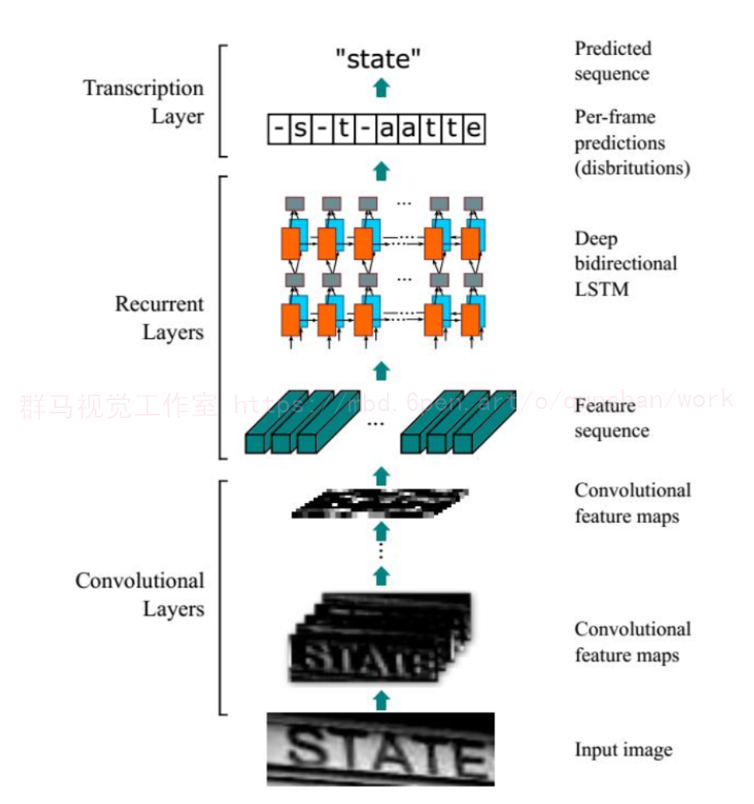

因为RNN有梯度消失的问题，不能获取更多上下文信息，所以采用[该博客提出的改进后的LSTM](https://afdian.net/item?plan_id=53a444c05d7a11edb59152540025c377)，LSTM的特殊设计允许它捕获长距离依赖。

LSTM是单向的，它只使用过去的信息。然而，在基于图像的序列中，两个方向的上下文是相互有用且互补的。将两个LSTM，一个向前和一个向后组合到一个双向LSTM中。此外，可以堆叠多层双向LSTM，深层结构允许比浅层抽象更高层次的抽象。

这里采用的是两层各256单元的双向LSTM网络：
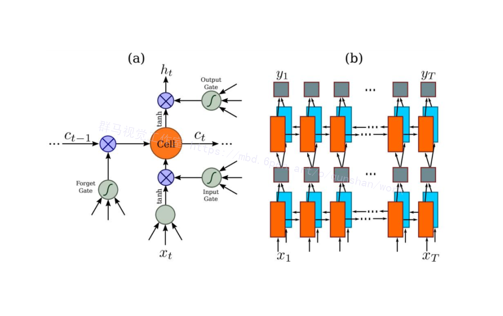
通过上面一步，我们得到了40个特征向量，每个特征向量长度为512，在LSTM中一个时间步就传入一个特征向量进行分类，这里一共有40个时间步。

我们知道一个特征向量就相当于原图中的一个小矩形区域，RNN的目标就是预测这个矩形区域为哪个字符，即根据输入的特征向量，进行预测，得到所有字符的softmax概率分布，这是一个长度为字符类别数的向量，作为CTC层的输入。

因为每个时间步都会有一个输入特征向量xT，输出一个所有字符的概率分布yT，所以输出为40个长度为字符类别数的向量构成的后验概率矩阵。如下图所示：
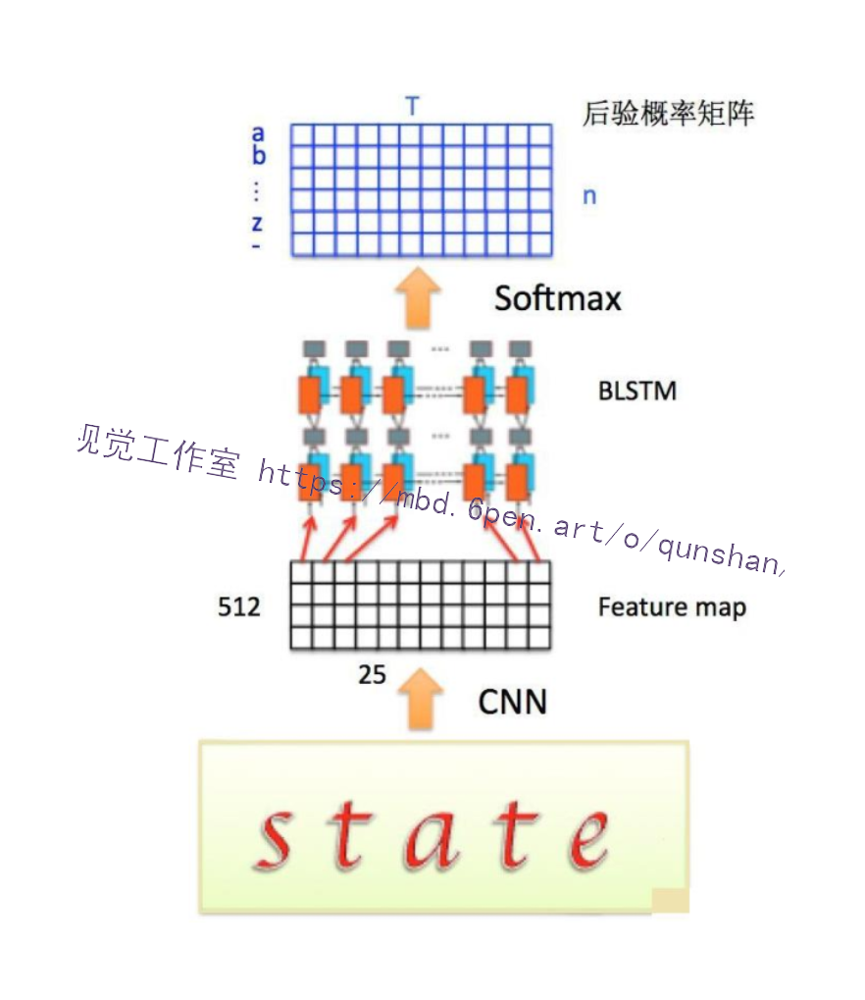

# 11.系统整合
下图[源码＆环境部署视频教程＆自定义UI界面](https://s.xiaocichang.com/s/8dfce8)
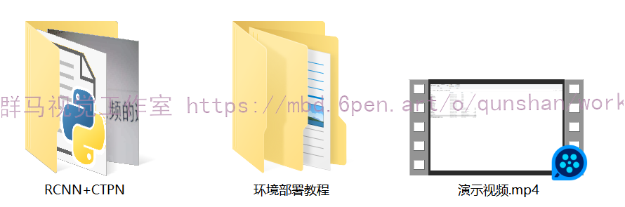

参考博客[《Python基于CRNN＆CTPN的自然场景文本检测系统（源码＆教程）》](https://mbd.pub/o/qunma/work)

# 12.参考文献
[1]Zhu, Yixing,Du, Jun.TextMountain: Accurate scene text detection via instance segmentation[J].Pattern Recognition: The Journal of the Pattern Recognition Society.2021.110DOI:10.1016/j.patcog.2020.107336.
[2]Luo, Canjie,Lin, Qingxiang,Liu, Yuliang,等.Separating Content from Style Using Adversarial Learning for Recognizing Text in the Wild[J].International Journal of Computer Vision.2021,129(4).960-976.DOI:10.1007/s11263-020-01411-1.
[3].Adaptive embedding gate for attention-based scene text recognition[J].Neurocomputing.2020,381(Mar.14).261-271.DOI:10.1016/j.neucom.2019.11.049.
[4].EPAN: Effective parts attention network for scene text recognition[J].Neurocomputing.2020,376(Feb.1).202-213.DOI:10.1016/j.neucom.2019.10.010.
[5]Liu, Yuliang,Jin, Lianwen,Zhang, Shuaitao,等.Curved scene text detection via transverse and longitudinal sequence connection[J].Pattern Recognition: The Journal of the Pattern Recognition Society.2019.90337-345.DOI:10.1016/j.patcog.2019.02.002.
[6]Gao, Yunze,Chen, Yingying,Wang, Jinqiao,等.Reading scene text with fully convolutional sequence modeling[J].Neurocomputing.2019,339(Apr.28).161-170.DOI:10.1016/j.neucom.2019.01.094.
[7]Xinjie Feng,Hongxun Yao,Shengping Zhang.Focal CTC Loss for Chinese Optical Character Recognition on Unbalanced Datasets[J].Complexity.2019,(1).9345861-1-9345861-11.DOI:10.1155/2019/9345861.
[8]Jun Tang,Zhibo Yang,Yongpan Wang,等.SegLink++: Detecting Dense and Arbitrary-shaped Scene Text by Instance-aware Component Grouping[J].Pattern Recognition.2019.96106954.DOI:10.1016/j.patcog.2019.06.020.
[9]Zhong, Zhuoyao,Sun, Lei,Huo, Qiang.An anchor-free region proposal network for Faster R-CNN-based text detection approaches[J].International journal on document analysis and recognition.2019,22(3).315-327.DOI:10.1007/s10032-019-00335-y.
[10]Luo, Canjie,Jin, Lianwen,Sun, Zenghui.MORAN: A Multi-Object Rectified Attention Network for scene text recognition[J].Pattern Recognition: The Journal of the Pattern Recognition Society.2019.90109-118.DOI:10.1016/j.patcog.2019.01.020.

---
#### 如果您需要更详细的【源码和环境部署教程】，除了通过【系统整合】小节的链接获取之外，还可以通过邮箱以下途径获取:
#### 1.请先在GitHub上为该项目点赞（Star），编辑一封邮件，附上点赞的截图、项目的中文描述概述（About）以及您的用途需求，发送到我们的邮箱
#### sharecode@yeah.net
#### 2.我们收到邮件后会定期根据邮件的接收顺序将【完整源码和环境部署教程】发送到您的邮箱。
#### 【免责声明】本文来源于用户投稿，如果侵犯任何第三方的合法权益，可通过邮箱联系删除。